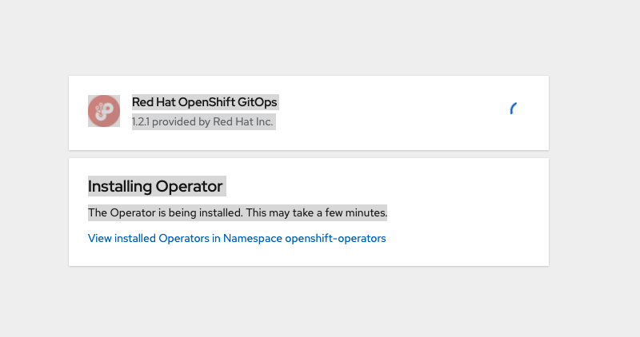
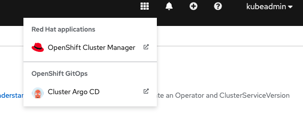

# Install OpenShift GitOps operator

OpenShift Gitops is provided as an add-on on top of OpenShift that can be installed via an operator that is available in the OpenShift OperatorHub.

## Steps:

First, connect to OpenShift console with a user that has Cluster administration right and make sure you are on the Administrator perspective as shown below:

Then, go to the `Operators -> OperatorHub`. You should now see a list of available operators for OpenShift provided by Red Hat, the community and our partners.

To facilitate the process, in the `Filter by keyword...`, type OpenShift GitOps to find the required operator:

Click on the Openshift GitOps operator to start the installation.  Leave the default setting and click install to start the installation process.

Once the installation is done, you should now see the OpenShift Pipeline Operator in the Installed Operators tab, as shown below:

:tada: CONGRATULATIONS 
The operator is now installed on the cluster.

The ArgoCD UI is now available in the Application Menu on the top.

Select Cluster Argo CD, this should bring you to the Argo CD Cluster:
